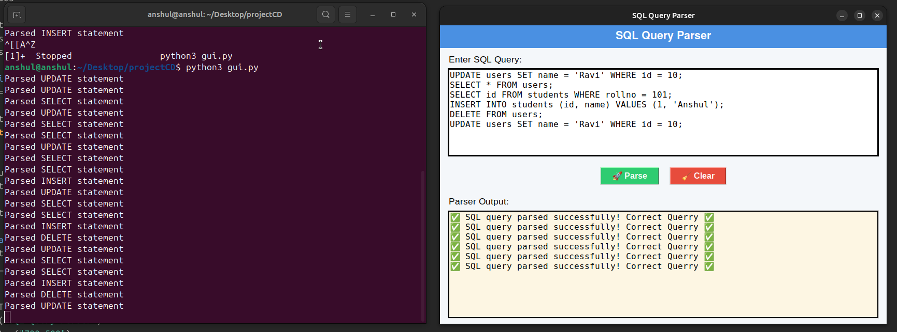

# SQL-QUERY-PASRSER
# GUI SQL Query Parser

This project employs **Lex, Yacc (Bison)**, and **Python Tkinter GUI** to parse simple SQL queries.
## Features
- Supported: `SELECT`, `INSERT`, `UPDATE`, `DELETE`
- Supports `WHERE` clause with `=`
- Implemented in **C (Lex/Bison)** and GUI in **Python (Tkinter)**


## ✅ Example Queries
```sql
SELECT * FROM users;
INSERT INTO students (id, name) VALUES (1, 'Anshul');
UPDATE users SET name = 'Ravi' WHERE id = 10;
DELETE FROM users WHERE id = 5;
```
## 🖼 GUI Screenshot


